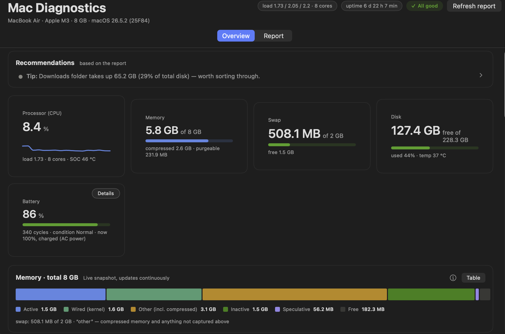
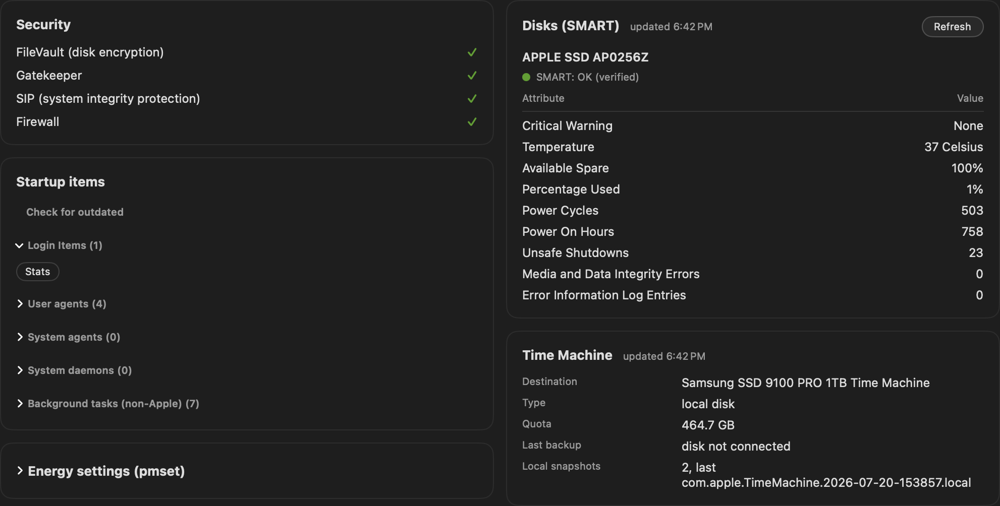
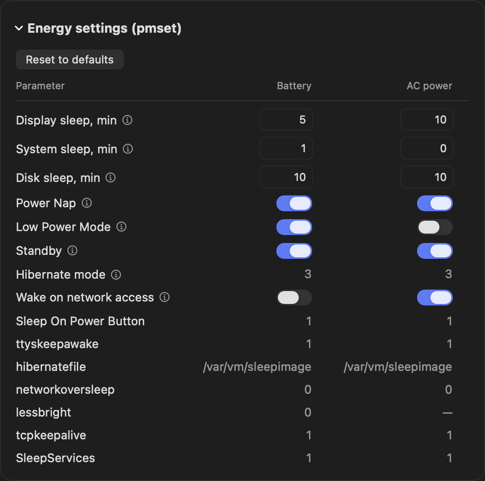

[Русская версия](README.ru.md)

# MacDashboard

Native SwiftUI app for diagnosing your Mac: no browser, no local server,
no dependencies — just one window. Bilingual — English and Russian,
switchable anytime in Settings.

## Screenshots

| Overview | Details |
| --- | --- |
|  |  |

| Energy settings | Battery popover |
| --- | --- |
|  |  |

## About this project

I'm not a developer — not even a programmer. I got curious what building
software actually feels like now, with AI in the loop, and I picked a topic I
genuinely cared about: the health of my own Mac. This app is the result,
built together with Claude Code. Now I'm sharing it, in case it's useful to
someone else too.

I plan to keep developing it further — I already have a few ideas. I'm
building this on my own Claude subscription, which limits how much I can get
done, but I find all of this genuinely fascinating. I also don't have an
Apple Developer license yet — it isn't cheap — so the ready-to-download `.app`
isn't notarized and needs a one-time Gatekeeper step on first launch (see
**Install** below); you can also just build it yourself from source. I've tried to respect privacy
and openness as much as realistically possible. I'd be glad to hear your
feedback and comments. Hope you like it!

## What it does

- On launch it automatically collects a full system report (disk, memory,
  security, Time Machine, login items/autostart, disk SMART data, battery,
  Homebrew, macOS updates) and saves it to
  `~/Library/Application Support/MacDashboard/mac_report.txt` — always a
  single file, each run overwrites the previous one.
- Live metrics (CPU, memory, swap, disk, battery, top processes) refresh every
  3 seconds. Switching a card between "Chart" and "Table" view doesn't stop
  the updates — both views read from the same live data.
- History (disk usage over time, battery cycles) accumulates in
  `~/Library/Application Support/MacDashboard/mac_check_state.json`
  (compatible with the old file format; can import an existing one).
- SOC and internal-disk temperatures, read via Apple Silicon's private HID
  sensor API (Intel Macs simply don't show this tile — no error, just absent).
- A handful of one-click maintenance actions, each explicit and confirmed
  (see "What it can change" below): cleaning up orphaned autostart entries,
  installing `smartmontools` for SMART data on external drives, refreshing
  the Time Machine status, running `brew upgrade`, enabling the firewall,
  emptying the Trash, and tweaking a couple of energy-saver settings.

## What it can change

By default MacDashboard only reads: it collects information and writes its
own report/history files under Application Support — nothing else. The only
exceptions are actions you explicitly click, each of which shows a
confirmation dialog (and, where the system requires it, a Touch ID / admin
password prompt) before doing anything:

- `brew upgrade` — upgrading installed Homebrew packages.
- installing `smartmontools` — so SMART attributes can be read on external
  NVMe/SSD drives.
- toggling the firewall on.
- changing an energy-saver (`pmset`) setting.
- emptying the Trash.
- removing an orphaned autostart entry (a login item / launch agent whose
  target executable no longer exists).

Nothing else in the app touches system state. If you never click one of the
buttons above, the app never changes anything.

## Privacy

MacDashboard sends none of your data anywhere. There is no telemetry, no
analytics, no crash reporting, no auto-update check, and no account of any
kind.

Every report and history file MacDashboard writes stays in
`~/Library/Application Support/MacDashboard/` on this Mac. Nothing is
uploaded.

**Honest network disclosure.** MacDashboard is not silent on the network —
here is everything it does:

- Collecting a report runs `softwareupdate -l`, which contacts Apple's own
  update service exactly as System Settings does. This sends none of your
  diagnostic data — only the same check Apple itself performs.
- `brew outdated` reads local Homebrew metadata only.
- The two actions you have to click yourself — Homebrew upgrade and
  installing `smartmontools` — download through Homebrew as usual.

Nothing else touches the network.

**The AI assistant is not built into the public release.** Its source is
present in the repository, gated behind a compile-time flag, and stays inert
unless you deliberately opt in: `MACDASHBOARD_AI=1 ./build_app.sh`. Building
with that flag sends the full diagnostic report to a third-party LLM provider
you configure. It is off by default, still under development, and not
something the app does unless you ask it to.

**What's in the report.** The diagnostic report MacDashboard collects is
machine-identifying: it can include folder names, installed-app hints,
running process names, and your Time Machine destination name. This stays
entirely local — but if you ever choose to share a report (for example,
filing a bug), you're sharing that detail too. See the issue template's
privacy notice before attaching anything.

## Requirements

- macOS 14 (Sonoma) or newer, Apple Silicon or Intel (universal binary).
- Nothing to install. Optionally: `smartmontools` (`brew install
  smartmontools`) to see SMART attributes for external NVMe drives — the app
  can also install it for you with one click.

## Install

Two ways — pick one.

### Download the ready-made app (easiest)

1. Open the [Releases](../../releases) page and download `MacDashboard.zip` from the latest release.
2. *Optional — verify the download.* Compare the hash against the **SHA-256** line in the release notes:
   ```bash
   shasum -a 256 MacDashboard.zip
   ```
3. Unzip and move `MacDashboard.app` into `/Applications` (or `~/Applications`).
4. **First launch — a one-time Gatekeeper step.** The app is ad-hoc signed but
   *not notarized* (I don't have an Apple Developer certificate yet), so the first
   time you open a copy downloaded from the internet macOS blocks it. Clear it once,
   either way:

   **Via System Settings (no Terminal):**
   1. Double-click `MacDashboard.app`. macOS shows **"MacDashboard" Not Opened** — click **Done** (this first dialog deliberately offers no "open" button).
   2. Open **System Settings → Privacy & Security** and scroll down to the *Security* section. Next to **"MacDashboard" was blocked to protect your Mac** click **Open Anyway**.
   3. In the **Open "MacDashboard"?** dialog click **Open Anyway** again, then authenticate with Touch ID or your password.

   > On macOS 15 (Sequoia) and later the old "right-click → Open" trick no longer bypasses Gatekeeper — use System Settings or the Terminal command below.

   **Or in Terminal — one command, same effect:**
   ```bash
   xattr -dr com.apple.quarantine /Applications/MacDashboard.app
   ```
   then open the app normally.

   That's it — every later launch opens with no prompt.

### Build from source

```bash
git clone https://github.com/rdskcm/MacDashboard.git
cd MacDashboard
./build_app.sh            # builds dist/MacDashboard.app
./build_app.sh --install  # ...and copies it into ~/Applications
```

An app you build yourself carries no download quarantine, so it opens with no Gatekeeper prompt at all.

## First launch

On first launch macOS will ask for a couple of permissions (you can decline —
the corresponding sections will simply show "unavailable" instead of crashing):

- access to the Downloads/Documents/Desktop folders — for the "what's taking up space" breakdown;
- control over "System Events" — to read the Login Items (autostart) list.

### Full Disk Access

Without **Full Disk Access** macOS hides some folders from the app, and the
"what's taking up space" breakdown silently loses them — the Trash in particular.
The app no longer stays quiet about it: the affected Folders tab shows a calm line
naming what it could not see, with a button that opens the right System Settings
pane, and one matching recommendation appears in the summary.

To grant it: **System Settings → Privacy & Security → Full Disk Access → +**, pick
`MacDashboard.app` (or switch it on if it is already listed). macOS restarts the app
afterwards.

A separate, unrelated grant: the **Empty the Trash** action drives Finder through
Automation, so the first time you use it macOS asks for permission to control
"Finder". Declining leaves the Trash untouched and shows Finder's own message —
nothing else in the app is affected.

Missing hardware (no battery on a desktop Mac, no external disks, Time Machine
not configured) is a normal, expected state: the relevant cards hide themselves
or show a calm "not set up / none" instead of an error.

## Moving to another Mac

Copy `MacDashboard.app` over (AirDrop, USB drive, whatever). If it picked up a
quarantine flag along the way, clear it exactly as in the first-launch step above.

## Structure

- `Sources/MacDashboard/` — the app itself (SwiftUI, no external dependencies).
- `Checks/` — parser/assessment checks (`swift run MacDashboardChecks`).
- `build_app.sh` — universal build + `.app` packaging + ad-hoc codesign.
- `SPEC.md` — the original build-out brief. Part of it is still binding (data
  contracts, collectors, packaging); the rest records how v1.0 was built. Each section
  is labelled — see the status table at the top of the file.

## Feedback

Found a bug or have a feature idea? Open an
[Issue](https://github.com/rdskcm/MacDashboard/issues) — the bug and feature
templates will guide you (the bug template also explains what's safe to
attach and what isn't; see the Privacy section above before including a
report file or screenshot). Found a security issue? See
[`SECURITY.md`](SECURITY.md) for how to report it privately instead.

## License

MIT — see [`LICENSE`](LICENSE).

## Acknowledgments

Nearly all of the code was written from scratch for this project — nothing
else was copied from elsewhere. One narrow technical technique was adapted
from open-source prior art:

- Reading Apple Silicon temperature sensors via the private
  `IOHIDEventSystemClient` API
  (`Sources/MacDashboard/Engine/ThermalHIDReader.swift`) follows a publicly
  documented technique used by [exelban/stats](https://github.com/exelban/stats)
  (MIT license) and the [smctemp](https://github.com/narugit/smctemp) project.
  The technique itself — the specific private `IOHIDEventSystemClient*`
  symbols that IOKit.framework exports but doesn't declare in its public
  headers — comes from there; the implementation here (runtime `dlopen`/`dlsym`
  symbol resolution, plus a small C spike in `tools/thermal_probe.c`) was
  written independently for this codebase.

---

"HAPPINESS FOR EVERYBODY, FREE, AND NO ONE WILL GO AWAY UNSATISFIED!"

— Arkady and Boris Strugatsky, *Roadside Picnic* (1972), translated by Antonina W. Bouis.
