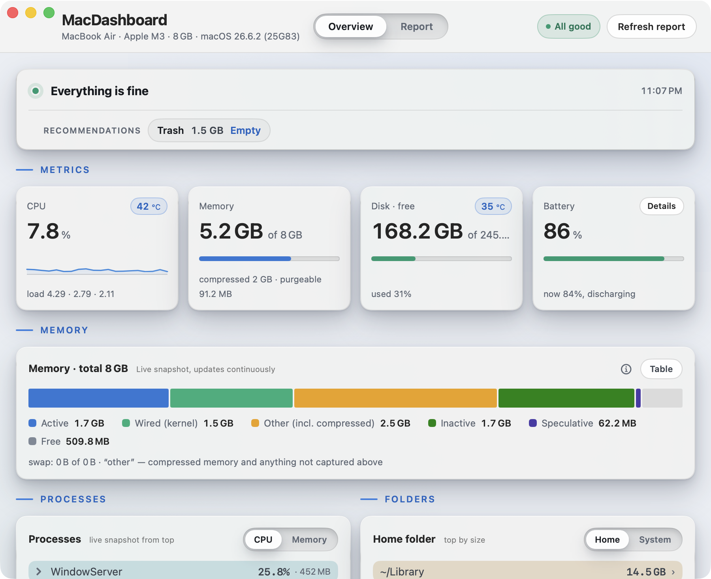
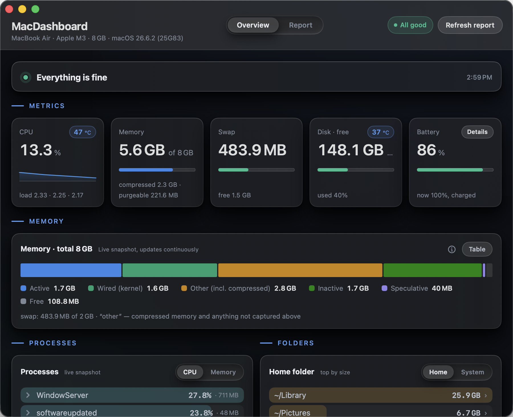
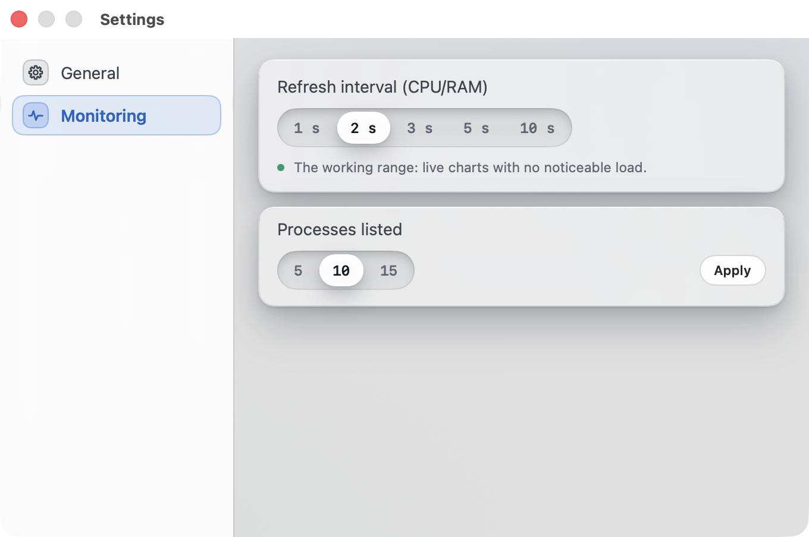
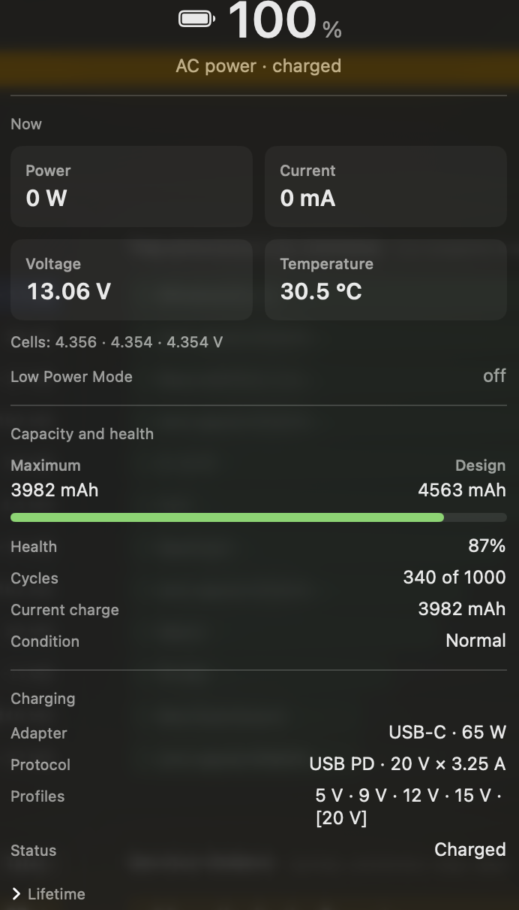

[English version](README.md)

# MacDashboard

Нативное SwiftUI-приложение диагностики Mac: никакого браузера, сервера
и зависимостей — одно окно. Двуязычное — русский и английский, переключаются
в любой момент в Настройках.

## Скриншоты

| Обзор (светлая тема) | Обзор (тёмная тема) |
| --- | --- |
|  |  |

| Настройки | Батарея |
| --- | --- |
|  |  |

## Об этом проекте

Я не разработчик — и даже не программист. Мне стало интересно, каково это —
создавать программы сейчас, с помощью ИИ, и я выбрал тему, которая мне реально
близка: здоровье собственного Mac. Так появилось это приложение — вместе с
Claude Code. Теперь я делюсь им — вдруг пригодится ещё кому-то.

Приложение планирую развивать и дальше, несколько идей уже есть. Разработка
идёт на моей личной подписке Claude — это ограничивает, сколько я успеваю, но
мне всё это правда очень интересно. Лицензии Apple Developer у меня тоже пока
нет — она недешёвая, поэтому готовый `.app` для скачивания не нотаризован и при
первом запуске требует разового шага с Gatekeeper (см. «**Установка**» ниже); при
желании приложение можно просто собрать из исходников самому. Старался соблюдать законы
приватности и открытости настолько, насколько это вообще возможно. Буду рад
вашим отзывам и замечаниям. Надеюсь, вам понравится!

## Что делает

- При запуске автоматически собирает полный отчёт о системе (диск, память,
  безопасность, Time Machine, автозагрузка, SMART дисков, батарея, Homebrew,
  обновления macOS) и сохраняет его в
  `~/Library/Application Support/MacDashboard/mac_report.txt` —
  **всегда один файл, новый отчёт перезаписывает старый**.
- Живые метрики (CPU, память, swap, диск, батарея) обновляются раз в 2 секунды
  (интервал настраивается — 1/2/3/5/10 с — в «Настройки → Мониторинг»); списки
  процессов — раз в 6 секунд. Переключение карточки «График ⇄ Таблица» не
  останавливает обновление — обе проекции читают одни и те же данные.
- История (занятость диска, циклы батареи) копится в
  `~/Library/Application Support/MacDashboard/mac_check_state.json`
  (совместим со старым форматом; есть импорт старого файла).
- Температура SoC и внутренних дисков — через приватный HID-API сенсоров
  Apple Silicon (на Intel Mac эта плитка просто не показывается, без ошибок).
- Несколько действий в один клик, каждое — явное и с подтверждением (см.
  «Что приложение может изменить» ниже): очистка «осиротевших» пунктов
  автозагрузки, установка `smartmontools` для SMART внешних дисков,
  обновление статуса Time Machine, запуск `brew upgrade`, включение
  файрвола, очистка корзины и правка пары настроек энергосбережения.

## Что приложение может изменить

По умолчанию MacDashboard только читает: собирает информацию и пишет
собственные файлы отчёта/истории в Application Support — и больше ничего.
Исключение — действия, которые вы явно запускаете кликом; каждое из них
показывает диалог подтверждения (а где это требуется системой — ещё и запрос
Touch ID / пароля администратора), прежде чем что-то менять:

- `brew upgrade` — обновление установленных пакетов Homebrew.
- установка `smartmontools` — чтобы читать SMART-атрибуты внешних
  NVMe/SSD-дисков.
- включение файрвола.
- изменение настройки энергосбережения (`pmset`).
- очистка корзины.
- удаление «осиротевшего» пункта автозагрузки (login item или launch agent,
  чей исполняемый файл больше не существует).

Больше ничего в приложении не трогает состояние системы. Если вы ни разу не
нажмёте ни одну из этих кнопок, приложение вообще ничего не изменит.

## Приватность

MacDashboard никуда не отправляет ваши данные. Нет телеметрии, нет
аналитики, нет отчётов о сбоях, нет проверки обновлений самого приложения,
нет учётной записи.

Все файлы отчётов и истории, которые создаёт MacDashboard, остаются в
`~/Library/Application Support/MacDashboard/` на этом Mac. Ничего никуда не
выгружается.

**Честное раскрытие сетевой активности.** MacDashboard не молчит в сети —
вот всё, что он делает:

- Сбор отчёта запускает `softwareupdate -l`, который обращается к серверу
  обновлений Apple точно так же, как это делают Системные настройки. Это не
  отправляет ваши диагностические данные — только ту же проверку, что
  выполняет сама Apple.
- `brew outdated` читает только локальные метаданные Homebrew.
- Два действия, которые вы запускаете сами, — обновление через Homebrew и
  установка `smartmontools`, — скачивают данные через Homebrew как обычно.

Больше ничего в сеть не обращается.

**AI-ассистент не встроен в публичную сборку.** Его исходный код
присутствует в репозитории, скрыт за флагом времени компиляции и остаётся
неактивным, пока вы сознательно не включите его:
`MACDASHBOARD_AI=1 ./build_app.sh`. Сборка с этим флагом отправляет полный
диагностический отчёт стороннему провайдеру LLM, который вы настраиваете
сами. Функция выключена по умолчанию, всё ещё находится в разработке и
ничего не делает, пока вы сами её не попросите.

**Что содержит отчёт.** Диагностический отчёт, который собирает
MacDashboard, идентифицирует машину: в нём могут быть имена папок, признаки
установленных приложений, имена запущенных процессов и имя точки назначения
Time Machine. Всё это остаётся локально — но если вы решите поделиться
отчётом (например, при сообщении об ошибке), вы делитесь и этими данными.
Прежде чем что-то прикладывать, посмотрите примечание о приватности в
шаблоне issue.

## Требования

- macOS 14 (Sonoma) и новее, Apple Silicon или Intel (universal binary).
- Ничего устанавливать не нужно. Опционально: `smartmontools` (`brew install
  smartmontools`) — тогда для внешних NVMe появятся атрибуты SMART; приложение
  умеет поставить его само в один клик.

## Установка

Два способа — выберите один.

### Скачать готовое приложение (проще всего)

1. Откройте страницу [Releases](../../releases) и скачайте `MacDashboard.zip` из последнего релиза.
2. *Необязательно — проверьте загрузку.* Сверьте хеш со строкой **SHA-256** в описании релиза:
   ```bash
   shasum -a 256 MacDashboard.zip
   ```
3. Распакуйте и переместите `MacDashboard.app` в `/Applications` (или `~/Applications`).
4. **Первый запуск — разовый шаг с Gatekeeper.** Приложение подписано ad-hoc, но
   *не нотаризовано* (лицензии Apple Developer у меня пока нет), поэтому при первом
   открытии скачанной из интернета копии macOS его блокирует. Разрешите один раз —
   любым способом:

   **Через Системные настройки (без терминала):**
   1. Дважды кликните по `MacDashboard.app`. macOS покажет **«Не удалось открыть „MacDashboard"»** — нажмите **Готово** (в этом первом окне кнопки «открыть» намеренно нет).
   2. Откройте **Системные настройки → Конфиденциальность и безопасность**, пролистайте до раздела *Безопасность*. Рядом с **«Приложение „MacDashboard" заблокировано для защиты Mac»** нажмите **Всё равно открыть**.
   3. В окне **«Открыть „MacDashboard"?»** снова нажмите **Всё равно открыть** и подтвердите через Touch ID или пароль.

   > В macOS 15 (Sequoia) и новее старый трюк «правый клик → Открыть» больше не обходит Gatekeeper — нужно либо через Системные настройки, либо командой в терминале ниже.

   **Или в терминале — одна команда, тот же результат:**
   ```bash
   xattr -dr com.apple.quarantine /Applications/MacDashboard.app
   ```
   после этого открывайте как обычно.

   Готово — все последующие запуски проходят без предупреждений.

### Собрать из исходников

```bash
git clone https://github.com/rdskcm/MacDashboard.git
cd MacDashboard
./build_app.sh            # соберёт dist/MacDashboard.app
./build_app.sh --install  # и скопирует в ~/Applications
```

Собранное самостоятельно приложение не получает карантина от скачивания —
открывается вообще без вопросов Gatekeeper.

## Первый запуск

При первом запуске macOS спросит пару разрешений (можно отказывать —
соответствующие разделы просто покажут «недоступно», без сбоя):

- доступ к папкам «Загрузки/Документы/Рабочий стол» — для раздела «что занимает место»;
- управление «System Events» — для списка автозагрузки (Login Items).

### Полный доступ к диску

Без **полного доступа к диску** macOS прячет от приложения часть папок, и раздел
«что занимает место» молча теряет их — в первую очередь Корзину. Теперь приложение
об этом не молчит: в карточке «Папки» появляется спокойная строка с перечнем того,
что не удалось увидеть, и кнопка, открывающая нужный раздел системных настроек, а в
сводке — одна соответствующая рекомендация.

Как выдать: **Системные настройки → Конфиденциальность и безопасность → Полный
доступ к диску → +**, выбрать `MacDashboard.app` (или включить переключатель, если
приложение уже в списке). После этого macOS перезапустит приложение.

Отдельное, не связанное с этим разрешение: действие «Очистить корзину» управляет
Finder через Automation, поэтому при первом использовании macOS спросит разрешение
на управление Finder. Отказ означает, что корзина останется как была и появится
сообщение самого Finder, — на остальное это не влияет.

Отсутствующее оборудование (нет батареи на десктопе, нет внешних дисков, не
настроен Time Machine) — штатная ситуация: соответствующие карточки прячутся или
спокойно показывают «не настроено / нет», а не ошибку.

## Перенос на другой Mac

Скопируйте `MacDashboard.app` (AirDrop, флешка — как угодно). Если по дороге на нём
появился флаг карантина, снимите его так же, как в шаге про первый запуск выше.

## Структура

- `Sources/MacDashboard/` — приложение (SwiftUI, без внешних зависимостей).
- `Checks/` — проверки парсеров/оценок (`swift run MacDashboardChecks`).
- `build_app.sh` — сборка universal + упаковка .app + ad-hoc подпись.
- `SPEC.md` — исходное ТЗ на постройку приложения. Часть его действует до сих пор
  (контракты данных, сборщики, упаковка), остальное описывает, как строилась 1.0.
  Каждый раздел помечен — см. таблицу статуса в начале файла.

## Обратная связь

Нашли баг или есть идея фичи? Откройте
[Issue](https://github.com/rdskcm/MacDashboard/issues) — шаблоны бага и
фичи подскажут, что заполнить (шаблон бага также объясняет, что можно
прикладывать, а что нет — см. раздел «Приватность» выше, прежде чем
прикладывать файл отчёта или скриншот). Нашли уязвимость? Смотрите
[`SECURITY.md`](SECURITY.md) — как сообщить о ней приватно.

## Лицензия

MIT — см. [`LICENSE`](LICENSE).

## Благодарности

Практически весь код написан с нуля для этого проекта, сторонний код не
копировался. Один узкий технический приём — использован по образцу открытых
проектов:

- Чтение температурных сенсоров Apple Silicon через приватный API
  `IOHIDEventSystemClient` (`Sources/MacDashboard/Engine/ThermalHIDReader.swift`)
  реализовано по мотивам публично задокументированной техники из
  [exelban/stats](https://github.com/exelban/stats) (MIT) и проекта
  [smctemp](https://github.com/narugit/smctemp) — сама техника (реверс
  приватных символов `IOHIDEventSystemClient*`, экспортируемых `IOKit.framework`,
  но не объявленных в публичных заголовках) взята оттуда, реализация написана
  самостоятельно (рантайм-резолв символов через `dlopen`/`dlsym`, C-спайк в
  `tools/thermal_probe.c`).

---

«Счастье для всех, даром, и пусть никто не уйдёт обиженный!»

— А. и Б. Стругацкие, «Пикник на обочине» (1972).
